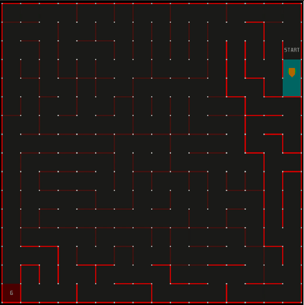

# Maze-Solver-simulation-using-Wall-Following-Algorithm

Implementation of the "wall following" algorithm using OOP

A micro mouse solver using left and right wall follower algorithms implemented using C++.

A micro mouse to reach a final destination in a maze using the Left and Right Wall Follower Algorithm. The project is implemented using C++ and a micro mouse Simulator. The algorithm designed works on a large variety of mazes designed in the Simulator efficiently. The algorithm is designed using Object Oriented Approach in C++ implementing the concepts of encapsulation and abstraction. The mouse reaches back to its origin from its final destination by keeping track of its forward path and reaching in shortest distance possible.

How To Run?
1. Install the Simulator Environment on your system. Please refer to https://github.com/mackorone/mms (Credits to Mack for Simulator Software) for Installation of the Simulator.
2. Give the relative path in the Simulator of the application folder including all sub-program files designed for various functionalities.
3. Click on Run in the Simulator Environment to see the mouse moving along the path.
4. The algorithm can be tested on different mazes present in mazefiles folder.

The output of the Wall following the algorithm from position (0,0) to the randomly generated goal looks like the following:

Re-tracing the path followed by the robot without using Wall the following algorithm and avoiding dead ends at the same time

